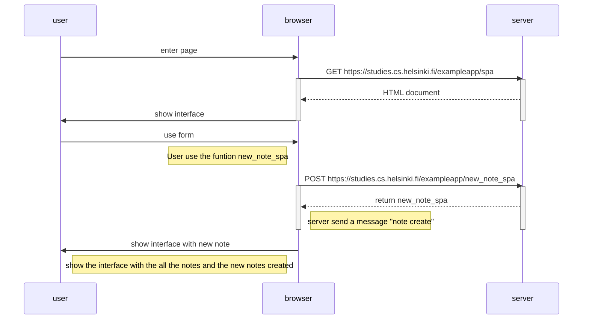

```mermaid
sequenceDiagram
    participant user
    participant browser
    participant server

    user->>browser: enter page
    browser->>server: GET https://studies.cs.helsinki.fi/exampleapp/spa
    activate browser
    activate server
    server-->>browser: HTML document
    browser->>user: show interface
    deactivate server
    deactivate browser


    user->>browser: use form
    Note left of browser: User use the funtion new_note_spa
    browser->>server: POST https://studies.cs.helsinki.fi/exampleapp/new_note_spa
    activate browser
    activate server
    server-->>browser: return new_note_spa
    Note right of browser: server send a message "note create"
    deactivate server
    deactivate browser
    browser->>user: show interface with new note
    Note left of browser: show the interface with the all the notes and the new notes created
```   

